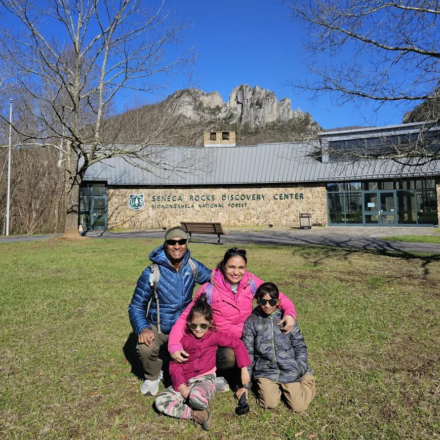

Are you ready to embrace the joy of the great outdoors?

::: {style="float: right; width: 350px; margin: 0 0 1em 1em;"}

:::

At **Outdoorsy Indians**, we are an Indian family sharing our outdoor adventures, one activity at a time.

Our journey began in Allahabad, Uttar Pradesh, India. We moved to the United States in 2018 when Dad came for a postdoctoral fellowship and later continued here for work. Soon after moving, we were amazed by the beauty, access, and variety of the great outdoors. From peaceful local trails to campsites, rivers, lakes, bike paths, and scenic drives, we quickly realized how much there was to explore.

Since then, we have been continuously stepping outside and trying new activities as a family. We started with simple hikes and slowly added camping, kayaking, biking, overlanding, and other outdoor adventures. We are still learning, still experimenting, and still discovering what works for a family with young kids.

This website is where we share that journey.

## Our Story

We did not grow up doing many of these outdoor activities. Hiking, camping, and kayaking as regular family activities were all things we learned gradually after moving to the United States.

That is why Outdoorsy Indians is not about being experts. It is about being curious, trying new things, making mistakes, learning along the way, and creating family memories outdoors.

We write about the places we visit, the activities we try, the gear we use, and the lessons we learn. We also share parts of our journey through our **[YouTube](https://www.youtube.com/@outdoorsyindians)** and **[Instagram](https://www.instagram.com/outdoorsyindians)** accounts.

## Our Mission

Our mission is to inspire more Indian families, especially families with young kids, to go outside and explore nature.

We know that getting started can feel intimidating. You may wonder what gear you need, where to go, what is safe for kids, what food to pack, how to plan a trip, or whether outdoor activities are really for families like yours.

Through our blog posts, videos, and photos, we hope to show that you do not have to be an expert to enjoy the outdoors. You can start small. You can begin with a short walk, a local park, a simple picnic, or an easy family hike. Over time, one small adventure can lead to another.

## For Indian Families and Everyone Else

Although we are an Indian family and many of our stories come from that perspective, Outdoorsy Indians is for everyone.

We hope Indian families around the world can see themselves in our journey and feel encouraged to explore the outdoors. For Indian families already living in the United States, our experiences may offer practical ideas, places to visit, and confidence to get started.

At the same time, nature belongs to everyone. Our stories, guides, and lessons are open to anyone who enjoys the outdoors or wants to begin exploring it.

Most of our content is in English, even though Hindi is our first language, so that more people can follow along and benefit from what we share.

## Follow Our Journey

We share our outdoor experiences here on this website through blog posts. You can also follow us on **[YouTube](https://www.youtube.com/@outdoorsyindians)** and **[Instagram](https://www.instagram.com/outdoorsyindians)**, where we post videos, photos, and moments from our family adventures.

If you are in the DMV area — Washington, D.C., Maryland, or Virginia — feel free to reach out. We would love to connect with other families who enjoy hiking, camping, biking, kayaking, or simply spending time in nature.

Maybe we can go on an adventure together.

Email: [contact@outdoorsyindians.com](mailto:contact@outdoorsyindians.com)

