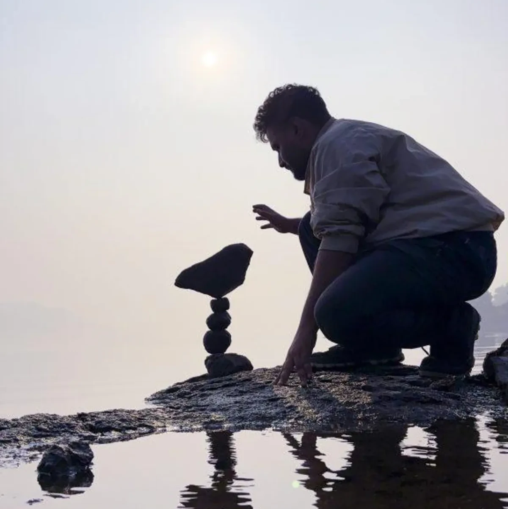
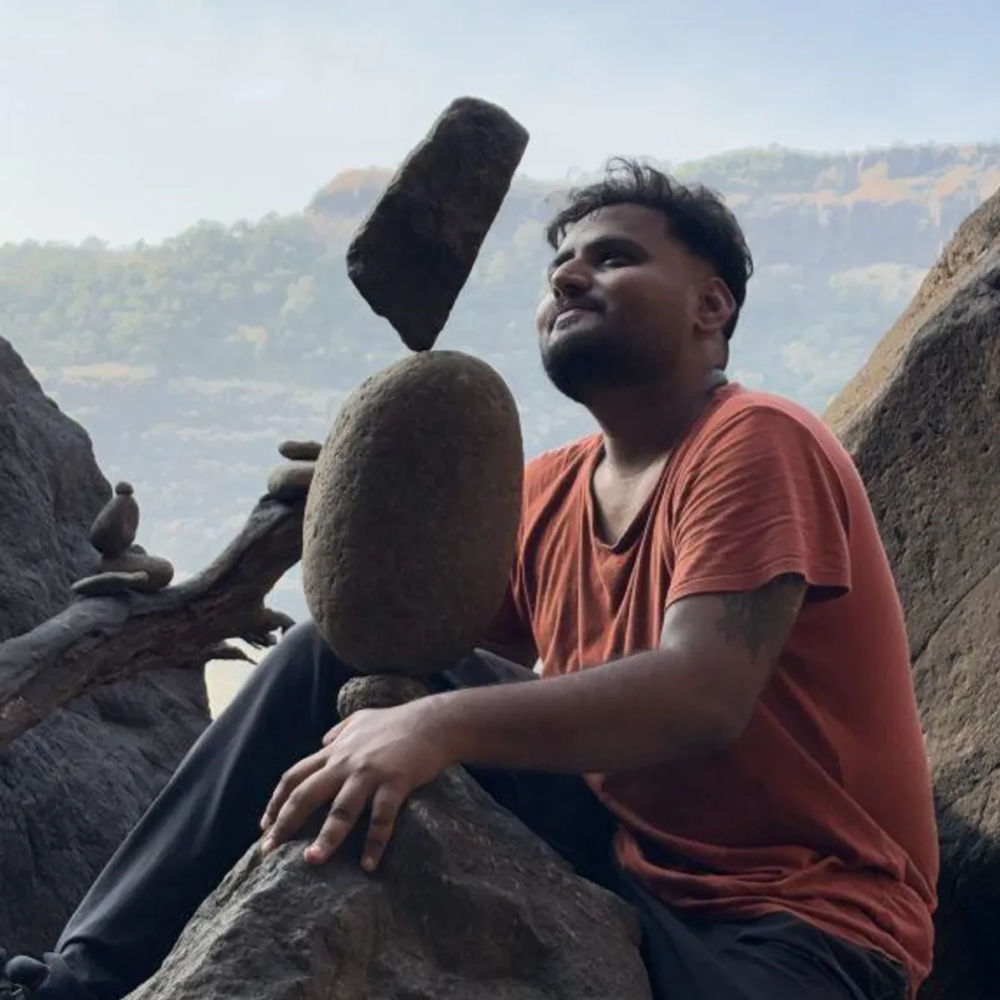
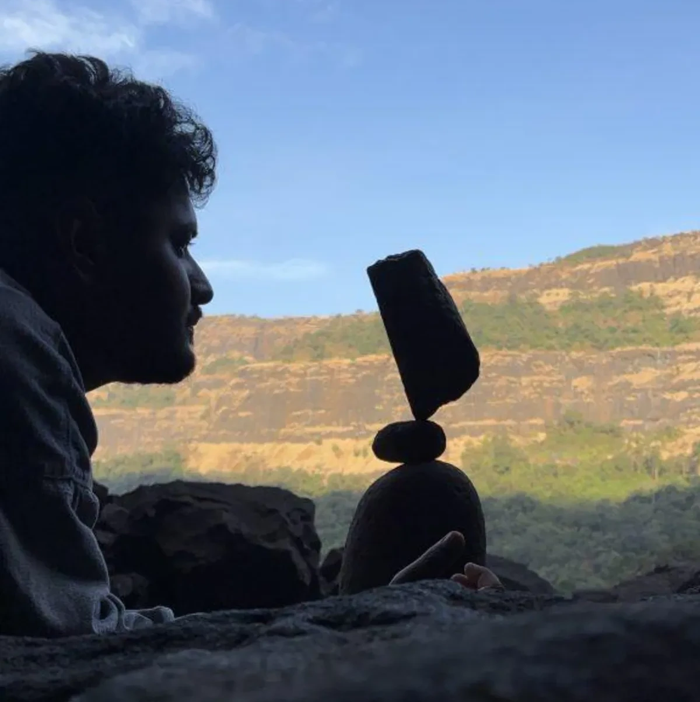
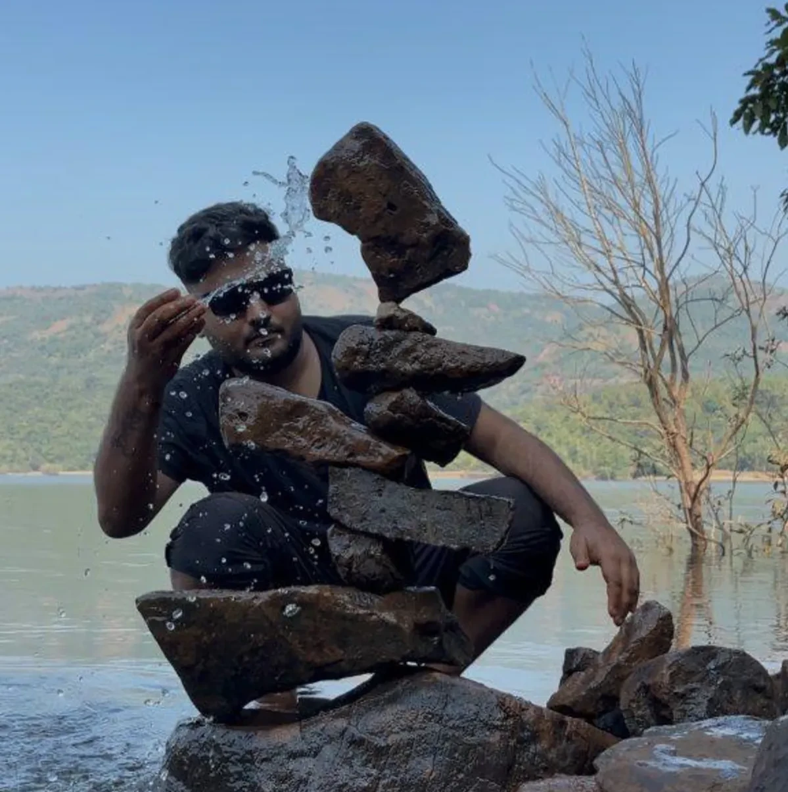
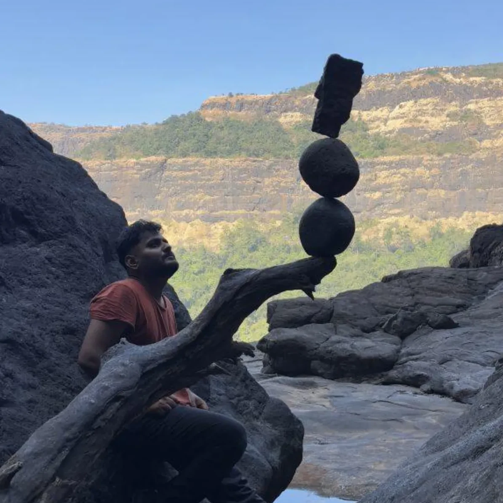

{.preview-image fit-alt="stack rock on seashore"}

Life has a way of leading us to unexpected places. For me, it took decades of exploration—through architecture, music, teaching, and trekking—before I discovered my true calling as a Rock Balancing Artist or Land Artist. What began as a casual experiment in June 2024 has evolved into a transformative practice that combines art, nature, and spirituality. But this story isn’t just about stacking rocks. It’s about a journey through frustration, self-discovery, and a profound connection to the world around us.

## A Different Kind of Birthday Gift
On February 25, 2024, I gave myself a birthday gift most wouldn’t dream of—a Vipassana meditation retreat. Instead of celebrating with loved ones, I attended a shibir in Pune, determined to learn the art of stillness. Yet, three days in, I returned home in tears, overwhelmed and disheartened. Meditation had always eluded me. I had grown weary of self-proclaimed gurus and spiritual jargon that led nowhere. My first attempt at Vipassana felt like another failure. But I couldn’t let it go. I reapplied and completed the full 10-day retreat on my second attempt. This time, something clicked. I experienced a deep clarity and calm that defied explanation—a glimpse of what spiritual leaders had spoken of. But this awakening came with a challenge. Back in the chaos of everyday life, I struggled to maintain that serene state. Daily meditation felt forced and futile, and I eventually gave up.

## Trekking Back to Myself
Frustrated, I returned to trekking, the one activity that always felt like home. It was during one of these treks that I stumbled upon the art of rock balancing. I had read about a workshop but couldn’t attend due to family commitments—and honestly, I thought the fee was steep for what seemed like “stacking rocks.” So, I set out on my own to Pune’s ARAI Tekdi, armed with curiosity and no expectations. My background as an architect gave me an intuitive sense of design, and years of trekking through the Sahyadris and Himalayas had sharpened my eye for natural landscapes. Even so, my first attempt was exhausting. I spent hours searching for the right rocks and struggled to balance them. But something about the process hooked me. I started sharing my experiments on Instagram, where I connected with a community of rock balancers. Observing their work inspired me to try new things, though every time I attempted to replicate their designs, I ended up creating something original. Without realizing it, I had found my own artistic voice.

::: {layout-ncol=2}

{group="rock-balancing"}

{group="rock-balancing"}

:::

## Where Art Meets Meditation
Rock balancing became more than a creative outlet—it became a form of meditation. Unlike my earlier attempts at forced stillness, this practice naturally brought me into a state of mindfulness. The focus required to balance each rock felt like a dialogue with nature, where spirituality and art converged effortlessly. In just seven months, this practice transformed my life. What I once sought through structured meditation now comes to me organically. Rock balancing has become my way of grounding myself, expressing creativity, and connecting with the world in a deeply meaningful way.

::: {layout-ncol=3}

{group="rock-balancing"}

{group="rock-balancing"}

{group="rock-balancing"}

:::

## Sharing the Balance
Today, I teach rock balancing through workshops designed to help participants find balance—both in rocks and in life. Each session is tailored to the environment and the needs of the group, making every workshop a unique experience. Whether it’s indoors or out in nature, the goal is always the same: to inspire others to explore this profound art form.

Through Instagram [@earthlingsaurabh](https://www.instagram.com/earthlingsaurabh/) and my community page [@rockbalanceindia](https://www.instagram.com/rockbalanceindia/), I’ve built a platform to showcase this art and connect with like-minded individuals. On my YouTube channel, Rock Balance India, I offer step-by-step lessons and behind-the-scenes glimpses into the process of creating these intricate works of balance.

## A Philosophy for Life
Rock balancing is more than art; it’s a way of life. It’s where spirituality, nature, and creativity intersect, offering a profound sense of stillness and connection. As I continue this journey, I remain open to wherever it may lead. For now, I’ll keep stacking rocks, one balance at a time, sharing this story with the world and inspiring others to find their own balance—both in art and in life.

Discover the art of stillness. Follow me on Instagram [@earthlingsaurabh](https://www.instagram.com/earthlingsaurabh/) and [@rockbalanceindia](https://www.instagram.com/rockbalanceindia/), and subscribe to my YouTube channel [@rockbalanceindia](https://www.youtube.com/@rockbalanceindia) for tutorials and insights into this transformative practice.
