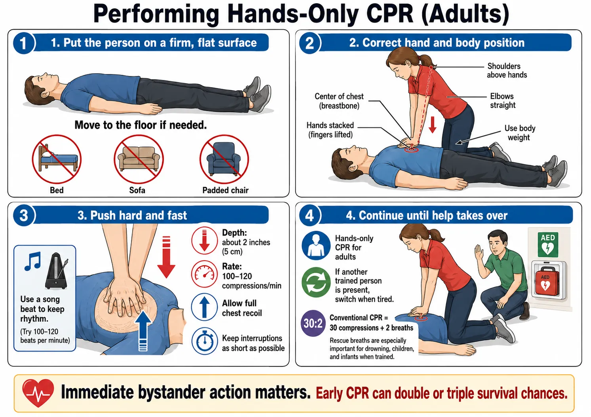
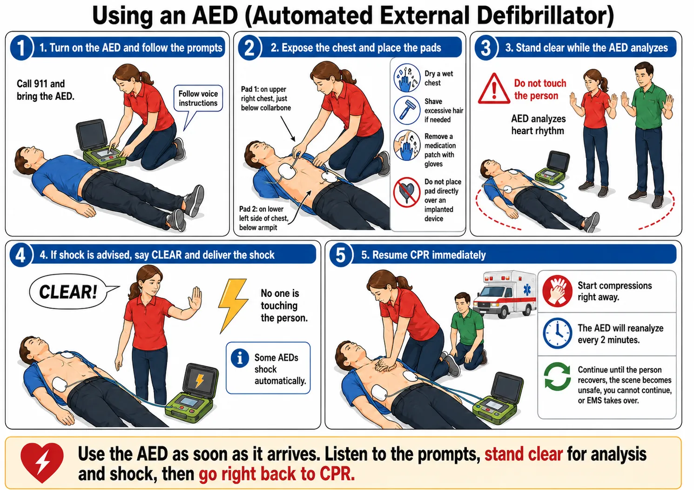
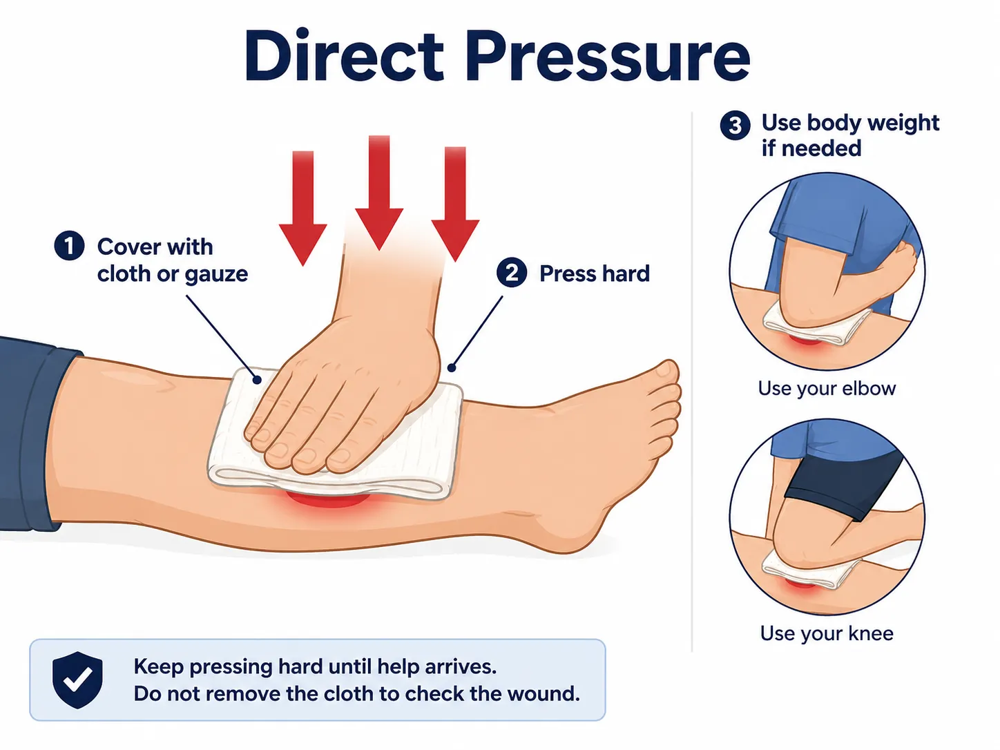
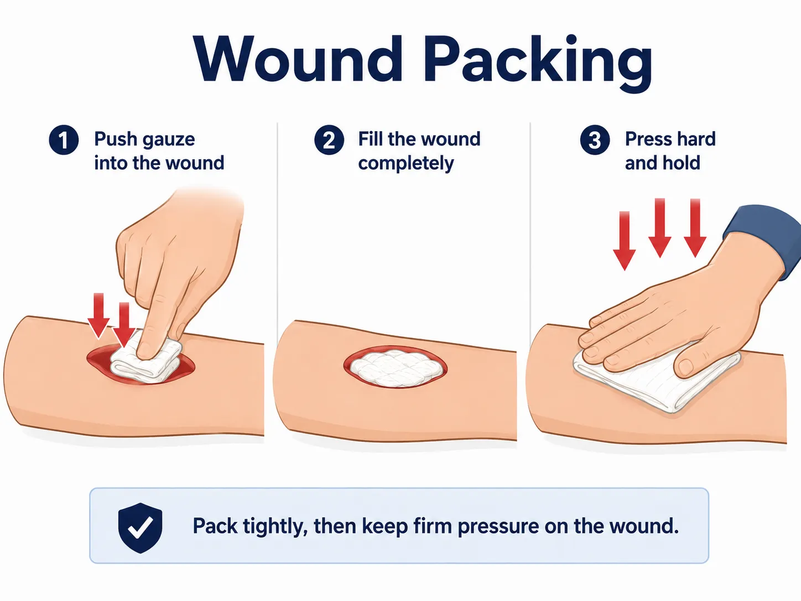
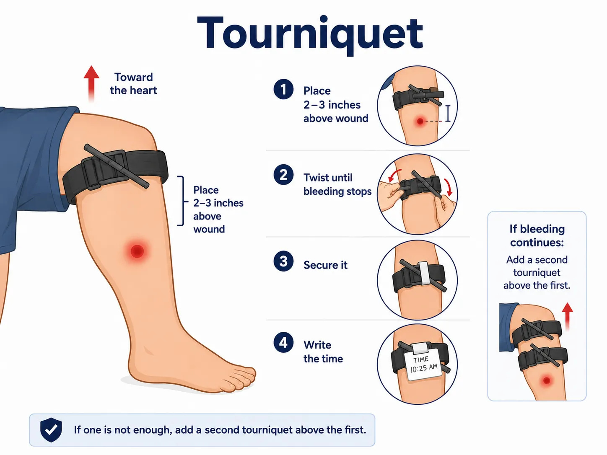

{.preview-image fit-alt="A man performing chest compressions on a mannequin." group="sal"}

Today, July 11, 2026, I attended a [**Save a Life Seminar and hands-on training**](https://www.eventbrite.com/e/save-a-life-seminar-saturday-july-11-2026-1000-am-100-pm-tickets-1990535191341) organized by [Montgomery County CERT](https://montgomerycert.org/). For me, this training was an extension of the Stop the Bleed training I completed on July 1 and wrote about in a previous [blog post](https://outdoorsyindians.com/posts/2026/learning-how-to-stop-severe-bleeding/). The seminar covered three emergency-response skills that ordinary people may need before professional help arrives:

* Hands-only CPR and use of an automated external defibrillator, or AED
* Control of life-threatening bleeding
* Recognition of an opioid overdose and administration of Narcan

Both the CPR and bleeding-control portions included hands-on practice with training mannequins. That practical experience was particularly valuable. It is one thing to hear someone explain where to place your hands or how tightly to turn a tourniquet. It is very different to kneel beside a mannequin, perform chest compressions, pack a simulated wound, and discover how much force these techniques actually require.

Montgomery County CERT offers these community seminars at no cost. They are intended to familiarize residents with lifesaving actions, although they do not provide a formal CPR or first-aid certification.

## Before Providing Help: Safety, Consent, and Calling 911

The seminar began with several principles that apply to almost every emergency.

The first is **scene safety**. Before approaching someone, we should stop briefly and look at what caused the emergency. Is there traffic, fire, electricity, a violent situation, a running power tool, broken glass, or some other danger? Becoming another injured person will not help the original patient.

The second principle is **consent**. If a person is conscious, introduce yourself, explain that you have some first-aid training, and ask whether you may help. Consent can also be withdrawn. If the person refuses assistance, you should not force physical treatment, but you can still call 911, continue talking with the person, and encourage them to apply pressure to their own wound.

When someone is unconscious and unable to respond, consent to necessary emergency care is generally implied. The instructors also discussed Maryland’s Good Samaritan law, which offers liability protection in many circumstances when a person provides emergency assistance in good faith, without compensation, and without gross negligence. It is not blanket immunity, so rescuers should act reasonably and remain within the skills they have learned.

The third principle is to **call 911 early**.

A dispatcher will ask what happened, whether the person is conscious and breathing, the approximate age of the patient, and other questions. While those questions are being asked, emergency resources can already be dispatched. The caller should stay on the line and follow the dispatcher’s instructions.

When alone, calling on a cellphone and placing it on speaker allows you to begin providing care while continuing to communicate with the dispatcher. Even when you cannot remember everything from a class, a trained dispatcher may be able to guide you through CPR or other immediate actions.

## Know Exactly Where You Are

One of the simplest but most memorable lessons was the importance of knowing your location.

During a stressful emergency, saying that you are “in a large building,” “at the mall,” or “somewhere on the highway” may not be enough. Responders may need:

* The street address
* The nearest intersection
* The direction of travel
* The building, floor, room, or apartment number
* A nearby store, entrance, trail marker, or other recognizable landmark

This is part of situational awareness. When entering a building, park, sporting facility, shopping center, or campground, it is worth noticing the address, exits, AED cabinets, first-aid supplies, and bleeding-control kits.

Montgomery County also supports **Text-to-911**. Calling is generally preferable when it is safe and possible, but a text can be used when speaking would be unsafe or when a person cannot make a voice call. The message should briefly state the emergency and exact location, followed by responses to the dispatcher’s questions.

## Recognizing Sudden Cardiac Arrest

The CPR portion began by explaining the difference between a **heart attack** and **cardiac arrest**.

A person experiencing a heart attack may still be awake and talking. They may report chest pressure, nausea, shortness of breath, or discomfort in the back, arm, neck, or jaw. They need immediate medical attention, but CPR is not performed on someone who remains responsive and is breathing normally.

Cardiac arrest means that the heart is no longer pumping blood effectively. The person may suddenly collapse, become unresponsive, and stop breathing normally. They might make gasping, snoring, or unusual breathing sounds, and they may briefly display seizure-like movements. These abnormal gasps should not be mistaken for normal breathing.

The American Heart Association describes cardiac arrest as an electrical malfunction that prevents the heart from pumping blood effectively, while a heart attack is a circulation problem caused by blocked blood flow. A heart attack can sometimes lead to cardiac arrest.

If an adult suddenly collapses:

1. Check whether the person responds.
2. Look for normal breathing.
3. Call 911 or direct someone specific to call.
4. Send someone to retrieve an AED.
5. Begin chest compressions.

Rather than shouting generally for someone to help, the instructors recommended assigning tasks directly: “You in the blue shirt, call 911,” or “Please get the AED from the hallway and bring it here.”

### Performing Hands-Only CPR

The course primarily taught **hands-only CPR for adults**.

The person must be lying on their back on a **firm, flat surface**. A bed, sofa, or padded chair absorbs the force of the compressions. If necessary, the person must be moved to the floor.

The heel of one hand is placed in the center of the chest on the breastbone, with the other hand on top. The elbows remain straight, with the rescuer’s shoulders directly above the hands. Using body weight rather than only arm strength makes the compressions more effective and reduces fatigue.

For an average adult, compressions should be approximately **two inches deep**, at a rate of **100 to 120 compressions per minute**. The chest should be allowed to recoil fully between compressions, while the hands remain in contact with it. Interruptions should be kept as short as possible.

Many people use a familiar song with a tempo between 100 and 120 beats per minute to maintain the correct rhythm. The specific song does not matter as long as its beat keeps the rescuer within the recommended range.

Practicing on a mannequin showed how physically demanding CPR can be. Effective compressions require significantly more force than they appear to require when watching a demonstration. If another trained person is present, rescuers may need to switch when one becomes tired, while minimizing any interruption.

The instructors also explained that conventional CPR includes cycles of **30 compressions and two rescue breaths**. The seminar concentrated on hands-only CPR because some bystanders may hesitate to help if they believe mouth-to-mouth breathing is mandatory. Rescue breaths can still be important in situations such as drowning and emergencies involving children or infants, particularly for people trained in conventional CPR.

The most important message was that immediate bystander action matters. Early CPR can double or triple a person’s chance of surviving cardiac arrest.

{group="sal"}

### Using an AED

An **automated external defibrillator** analyzes the electrical activity of the heart and determines whether a shock is appropriate. The user does not make that decision.

Although AEDs come in different shapes and models, their operation is generally similar:

1. Turn on the AED or open its case.
2. Follow the spoken instructions.
3. Expose the person’s bare chest.
4. Place the adhesive pads in the positions shown in the illustrations.
5. Make sure no one is touching the person while the AED analyzes the heart.
6. If a shock is advised, loudly say “Clear,” visually confirm that no one is touching the patient, and deliver the shock as instructed.
7. Resume CPR immediately.

Some AEDs require the rescuer to press a flashing shock button, while others administer the shock automatically after warning everyone to stand clear.

A shock is intended to interrupt certain dangerous, disorganized electrical rhythms so the heart’s natural electrical system has an opportunity to restore an organized rhythm. An AED will not shock a person unless it detects a rhythm for which defibrillation is appropriate.

After a shock—or after announcing that no shock is advised—the AED normally directs the rescuer to continue CPR. It will pause periodically to analyze the heart again. No electricity remains in the patient after the shock, so compressions should resume promptly.

The pads must adhere directly to bare skin. If the chest is very wet or sweaty, it should be wiped quickly so the pads will stick. Excessive hair may have to be removed from the pad locations using the razor commonly included in an AED kit. A medication patch that lies directly beneath a pad should be removed while wearing gloves, and a pad should not be placed directly over a visible implanted device.

Most importantly, continue CPR and AED use until the person shows clear signs of life, the scene becomes unsafe, you are physically unable to continue, or emergency responders take over. Seeing an ambulance arrive outside the building is not the signal to stop; care continues until responders reach the patient and explicitly assume responsibility.

{group="sal"}

## Recognizing Life-Threatening Bleeding

The bleeding-control portion focused on injuries that can cause death within minutes, rather than small cuts that can be handled with an ordinary adhesive bandage. This portion was similar to the Stop the Bleed training I mentioned before, with a few extras.

Possible signs of life-threatening bleeding include:

* Blood spurting or flowing continuously
* A rapidly growing pool of blood
* Clothing or bandages becoming saturated
* A deep or large wound
* A partial or complete amputation
* A person becoming pale, weak, confused, or unresponsive

The first actions are to check scene safety, call 911, obtain consent when possible, and protect yourself from contact with blood. Ideally, this means wearing nitrile gloves. When proper gloves are unavailable, a clean plastic bag or another waterproof barrier may provide some temporary protection.

Severe bleeding can become fatal within minutes, so treatment must begin before emergency medical services arrive.

### Direct Pressure Comes First

The first treatment for most external bleeding is **firm, continuous direct pressure**.

Place gauze, a trauma dressing, or available cloth directly over the wound and press firmly. In a true emergency, a clean T-shirt, towel, bandana, or similar fabric can be used. The immediate priority is controlling the bleeding; medical professionals can address contamination and infection risks later.

The pressure required may be much stronger than many people expect. The instructor demonstrated leaning over the wound and using body weight rather than pressing gently with the fingertips.

Once direct pressure begins, it should be maintained continuously. Frequently lifting the material to check the wound can disturb clot formation. If another person is present, they can maintain pressure while you put on gloves or obtain additional supplies.

A trauma pressure dressing can then be wrapped tightly over the wound while maintaining pressure.

{group="sal"}

### Packing a Deep Wound

Some wounds are too deep for pressure applied only at the surface.

These often occur at junctions where the limbs meet the body, such as the groin, armpit, shoulder, or neck area, where an ordinary tourniquet cannot be placed. Deep wounds in an arm or leg may also require packing.

To pack a wound, gauze or available cloth is pushed firmly into the wound cavity, beginning at the point where the blood appears to originate. More material is added until the cavity is completely filled. Firm direct pressure is then held over the packing, followed by a compression dressing when available.

The purpose is not simply to absorb blood. The material must create pressure against the source of the bleeding and the surrounding tissue.

The instructors emphasized that bystanders should **not pack wounds in the chest or abdomen**, which are large internal body cavities. Wound packing is most useful where there is enough surrounding muscle, tissue, and bone to provide resistance.

Practicing this technique on a simulated wound was one of the most helpful parts of the seminar. The word “packing” sounds straightforward, but the exercise demonstrated that the gauze must be inserted firmly and deliberately rather than placed loosely over the opening.

{group="sal"}

### Tourniquets for Severe Arm or Leg Bleeding

When life-threatening bleeding from an arm or leg cannot be controlled quickly with direct pressure—or when the injury is obviously catastrophic—a tourniquet may be necessary.

We practiced with a **Combat Application Tourniquet**, commonly called a CAT. It consists of a wide band, a windlass rod used to tighten it, and a clip that prevents the rod from unwinding.

A tourniquet is applied to an arm or leg, generally two to three inches above the wound and never directly over a joint. When the wound cannot be located quickly or circumstances require immediate action, the Montgomery County instructors taught the simplified instruction **“high and tight”** on the affected limb.

The band is first pulled as tight as possible. The windlass is then twisted until the bleeding stops and secured in its clip. An effective tourniquet will be painful, but discomfort is secondary when the alternative is uncontrolled blood loss.

The time of application should be written on the tourniquet or otherwise documented. Once applied, a bystander should **not loosen or remove it**. Removal belongs in a hospital or another appropriate medical setting. If one properly positioned tourniquet does not stop the bleeding, a second can be placed above the first.

The instructors also demonstrated the principles of an improvised tourniquet. It requires a sufficiently wide and flexible band, a strong object to serve as a windlass, and a way to secure that windlass after tightening. A narrow cord or lanyard is generally unsuitable, while folded cloth may work better. A commercially manufactured tourniquet remains preferable whenever one is available.

{group="sal"}

### Chest Wounds, Impaled Objects, and Amputations

The seminar briefly introduced several additional injury considerations.

A penetrating chest wound can allow air to enter the chest cavity and interfere with normal lung expansion. Commercial bleeding-control kits may contain chest seals designed to cover these openings. Because chest injuries can be complicated, the safest course for an untrained bystander is to call 911 immediately, follow the dispatcher’s instructions, and use commercial equipment only as trained.

An object embedded in the body should generally **not be pulled out**. It may be helping limit bleeding, and removing it can cause additional damage. Instead, pressure can be applied around the injury while bulky dressings are placed around the object to keep it from moving.

For a complete or partial amputation, bleeding from the affected limb must be controlled immediately, often with a tourniquet. The separated body part should be placed in a clean plastic bag, kept cool, and sent to the hospital with the patient. It should not be placed directly on ice or allowed to freeze.

## Recognizing an Opioid Overdose

I was unable to take detailed notes on the Narcan portion of the presentation, so I am supplementing my notes using official Maryland, Montgomery County, CDC, and FDA information.

**Narcan** is a brand name for **naloxone**, a medication that can rapidly reverse the effects of an opioid overdose. It can help restore breathing after an overdose involving opioids such as heroin, fentanyl, or prescription opioid medications. Its effect is temporary, so emergency medical care is still necessary even when the person wakes up.

Possible signs of an opioid overdose include:

* The person cannot be awakened
* Breathing is slow, shallow, irregular, or absent
* There are loud snoring, choking, or gurgling sounds
* The body is limp
* The pupils may be extremely small
* The lips, gums, nails, or fingertips appear blue, gray, or unusually pale
* The pulse is slow, irregular, or difficult to detect

When an opioid overdose is suspected:

1. Try to wake the person by calling their name and firmly rubbing your knuckles on the center of their chest.
2. Call 911 and provide the exact location.
3. Remove the intranasal naloxone device from its packaging.
4. Place the nozzle into one nostril and press the plunger firmly.
5. Support the person’s breathing and perform CPR if needed and if trained, following the dispatcher’s instructions.
6. If the person does not begin breathing normally or respond after approximately two to three minutes, give another dose using a new device when one is available.
7. Once the person is breathing, place them on their side to reduce the risk of choking.
8. Stay with them until emergency responders arrive.

Naloxone is considered safe to administer when an opioid overdose is suspected. It will not produce intoxication, and it is unlikely to harm a person whose condition turns out not to have been caused by opioids.

Someone who receives naloxone may awaken confused, frightened, agitated, nauseated, or experiencing sudden withdrawal symptoms. Remaining calm, explaining what happened, and encouraging the person to wait for medical help are important.

## What I Took Away from the Training

My biggest takeaway was that lifesaving care does not begin with advanced equipment or perfect medical knowledge. It begins with an ordinary person recognizing that something is wrong and deciding to act.

That action may mean:

* Calling 911 and clearly explaining the location
* Beginning chest compressions
* Bringing and operating an AED
* Pressing firmly on a bleeding wound
* Packing a deep wound
* Applying a tourniquet
* Administering naloxone

The hands-on practice helped replace some of the uncertainty with muscle memory. I now have a better understanding of how deep CPR compressions must be, how physically demanding they are, how tightly an effective tourniquet must be applied, and how firmly a wound must be packed.

The seminar also changed what I notice when entering a public place. I plan to pay more attention to addresses, exits, AED cabinets, bleeding-control kits, and other emergency supplies. During a real emergency, those few seconds of prior awareness could matter.

No brief seminar can make someone a medical professional, and this article is not a substitute for certified CPR, first-aid, bleeding-control, or naloxone training. However, the class reinforced an important point: **we do not need to know everything before we can do something useful**.

***Check that the scene is safe. Call 911. Follow the dispatcher and emergency equipment instructions. Use the skills you have practiced. Continue until professional help takes over.***