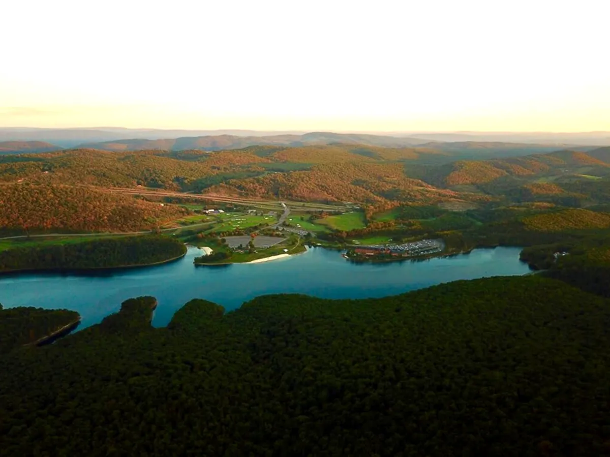

{.preview-image fit-alt="Rocky Gap State Park Sky View" group="rockygap"}

Our first family camping trip of the year took us back to [Rocky Gap State Park](https://dnr.maryland.gov/publiclands/pages/western/rockygap.aspx) in Western Maryland. We stayed there from May 15 to May 17, and this was our second time camping at this campground. The first trip (Site 259 in Ironwood Loop) gave us a memorable story, but not exactly the kind we wanted to repeat. We had been caught in a thunderstorm, our tent leaked, and we ended up spending the night in our car.

*This time was very different.*

The weather was mostly beautiful, we went with friends, and we planned our sleeping arrangements a little more carefully. Instead of booking only a tent site, we booked one tent site and one cabin next to each other; Sites 168 (tent-only) and 170 (log cabin) in Fir Loop. This worked really well because my wife and my friend’s wife are not big fans of sleeping in tents. The kids still got the camping experience, the adults had a little more comfort, and everyone could enjoy the trip in their own way.

Rocky Gap State Park turned out to be a great place for this kind of relaxed family car camping trip.

## Back to Rocky Gap, But With Better Planning

One of the nice things about returning to the same campground is that you arrive with a little more confidence. We already knew the general layout, the lake, the beach area, and the campground atmosphere. We also knew what could go wrong because of our previous thunderstorm experience.

This time, having a cabin next to the tent site gave the trip a much better balance. We still cooked outside, spent time around the campsite, relaxed in hammocks, and enjoyed the campground life. But we also had a more secure sleeping option for those who did not want to sleep in the tent.

For families where not everyone loves tent camping, this can be a very practical setup. One family can use the tent, another can use the cabin, and everyone can still spend the whole day together outdoors.

::: {layout-ncol=2}

{group="rockygap"}

{group="rockygap"}

{group="rockygap"}

:::

## Camp Cooking, Hammocks, and Slow Outdoor Time

Some of the best parts of camping are not big activities at all. They are the slow moments.

We cooked together (grilled tomahawk shank, portabello mushrooms, chili mac, bacon, sausages, scrambled eggs, and ramen noodles), sat around the campsite, watched the kids play, and enjoyed not having to rush from one thing to the next. The hammocks were a big hit, especially with the kids. Sometimes we adults think children need a long list of activities, but on this trip, the hammocks alone gave them hours of fun.

They climbed in and out, swung gently, rested, laughed, and treated the hammocks almost like a playground. It reminded me that camping does not always need to be packed with plans. Sometimes the simplest things become the most memorable.


*Colored campfire using a GoFire Northern Lights Color Flames packet that we bought from Walmart. Kids just loved it.*

## Lake Habeeb and the Beach

One of the biggest reasons Rocky Gap State Park is such a good family camping destination is Lake Habeeb. The lake is surrounded by mountains and gives the whole park a peaceful, scenic feel. According to Maryland DNR, Rocky Gap State Park covers more than 3,000 acres, and Lake Habeeb is a 243-acre lake known for having some of the bluest water in the state.

Because we went before the full summer rush, the beach was accessible but not officially in full operation. That actually made the experience feel special. We had a lot of space to ourselves and shared the beach with only a few other families.

For families with kids, that quieter beach atmosphere was wonderful. The children could play, we could relax, and the lake did not feel crowded. It felt like we had discovered a quieter version of Rocky Gap.

Of course, when lifeguards are not on duty, swimming is at your own risk. Maryland DNR notes that lifeguard hours can change and that swimming is allowed at your own risk when lifeguards are not present. So if you visit before or after the official beach season, it is important to be extra careful, especially with children.

## Kayaking and Paddle Boarding on the Lake

We also spent time on the water. Rocky Gap is a great place for kayaking, canoeing, and standup paddle boarding. The day-use area offers seasonal canoe, kayak, and SUP board rentals. Since we were in pre-season, we brought our inflatable kayak and paddleboard. 

One of the highlights of the trip was paddle boarding with my daughter Elsa. It was her first time paddling, and she did a wonderful job. We went out together on Lake Habeeb, enjoyed the calm water, and took in the views around us.

Those quiet father-daughter moments are the kind of memories I hope she remembers. We were not doing anything extreme or complicated. We were just paddling together, learning together, and enjoying the lake.
Then, toward the end, the weather changed.

Unexpected rain rolled in while we were still on the water. Suddenly, our peaceful paddle became a small adventure. With Elsa on board, we had to turn back and rush toward the beach. It was not dangerous, but it definitely got our attention and reminded us how quickly weather can change when you are outdoors.

That moment became the main story of the video from this trip.

**Video:** Paddle Boarding Lake Habeeb Before the Rain | Rocky Gap State Park Camping Trip



## Things to Do at Rocky Gap State Park

Rocky Gap State Park is one of the better car camping destinations in Western Maryland because there is a lot to do without needing to leave the park.

Some of the main activities include:

* **Camping:** The campground has tent and RV sites, including some electric sites, as well as mini-cabins and yurt options. Maryland DNR lists 278 individual campsites, including 30 with 30-amp electric hookups, plus mini-cabin and yurt options, a family group site, and youth group camping areas.

* **Cabins and comfort camping:** For families where some people love camping but others prefer a bed and walls, the cabin option can make the trip much easier. This worked very well for us.

* **Swimming and beach time:** The day-use area includes public swimming beaches, bathhouse facilities, picnic tables, grills, a playground, and trail access.

* **Kayaking, canoeing, and paddle boarding:** Lake Habeeb is the center of the park experience. It is great for paddling, and the park has seasonal watercraft rentals.

* **Fishing:** Lake Habeeb offers fishing piers, public boat ramps, and fishing opportunities. Maryland DNR notes that the lake has panfish, trout, catfish, and large and smallmouth bass. A Maryland freshwater fishing license is required for people 16 and older.

* **Hiking:** Rocky Gap has several trails. The Lakeside Loop Trail is a moderate 5.3-mile trail around Lake Habeeb, while the Canyon Overlook Trail is a much shorter scenic hike with views of the gorge.

* **Nature programs:** The park also has a nature center and interpretive programs during the summer, including nature hikes, crafts, children’s programs, campfire programs, and special events.

## Why Rocky Gap Works Well for Families

For us, Rocky Gap works because it offers a good mix of comfort and nature.

It is not a remote backcountry experience. It is car camping, which means you can bring more gear, food, chairs, hammocks, and things that make camping easier with kids. But it still feels outdoorsy because of the lake, mountains, trails, and campground setting.

::: {.column-margin}
[How to Tent Camp with Little Children](https://outdoorsyindians.com/posts/2023/tent-camping-with-children/)
:::

It also works well for groups. Booking nearby sites or combining a tent site with a cabin can make the experience more flexible. Some people can sleep in tents, some can sleep in cabins, and everyone can still gather together during the day.

For families who are still learning camping, or for people who want to introduce kids to the outdoors without making the trip too difficult, Rocky Gap is a very good option.

## A Few Lessons From This Trip

This trip reminded us of a few things.

First, weather matters. Our previous Rocky Gap trip involved a thunderstorm, a leaking tent, and a night in the car. This time the weather was much better, but even then, unexpected rain arrived while we were paddle boarding. Always check the forecast, but also be prepared for changes.

Second, comfort matters, especially for family camping. A cabin next to a tent site may not sound like “pure camping” to some people, but for us it made the trip more enjoyable for everyone. The goal is not to suffer outdoors. The goal is to spend time outside together.

Third, kids do not need complicated entertainment. A hammock, a beach, a lake, and friends were more than enough.

Finally, some of the best memories come from small adventures. Elsa’s first paddle boarding experience, the quiet moments on the lake, and the sudden rain on the way back all made this trip special.

## Final Thoughts

Our Rocky Gap camping trip was a great start to the family camping season. We cooked, relaxed, spent time with friends, played on the beach, paddled on Lake Habeeb, and made memories that we will keep talking about.

After our first stormy experience at this campground, it felt good to return and have a much better trip. Rocky Gap State Park gave us the right mix of nature, comfort, water activities, and family-friendly facilities.

For anyone in Maryland or nearby areas looking for a family car camping destination, Rocky Gap State Park is definitely worth considering. Whether you want to tent camp, try a cabin, paddle on the lake, hike a trail, or simply let the kids enjoy hammocks and beach time, it is a place where a weekend can feel like a real outdoor getaway.

* **Rocky Gap State Park Website:** [https://dnr.maryland.gov/publiclands/pages/western/rockygap.aspx](https://dnr.maryland.gov/publiclands/pages/western/rockygap.aspx)
* **Maryland Park Reservations Website:** [https://parkreservations.maryland.gov/](https://parkreservations.maryland.gov/)